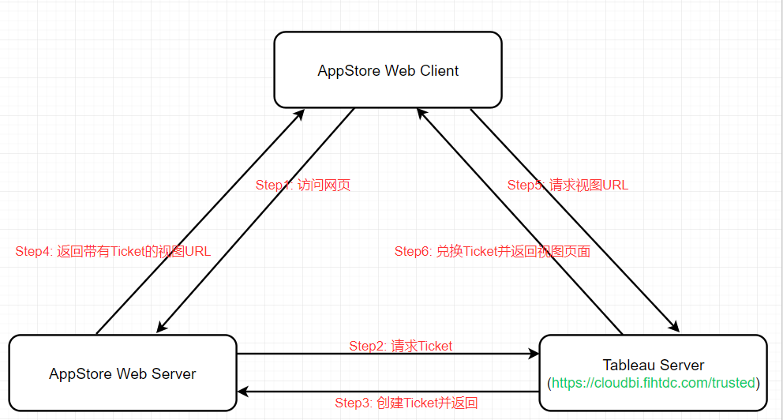

# Tableau

## Table of Content

1. [Tableau 可信任身份的工作原理](#working_principle)
2. [Tableau 使用流程](#manual)

<a name="working_principle" id="working_principle">

### Tableau 可信任身份的工作原理

## Contents

<div style="text-align: center"></div>
<br/>

<a name="manual" id="manual">

### Tableau 使用流程

1. 用户访问网页。当前用户访问具有嵌入式 Tableau Server 视图的网页的时候，网页会向 Web Server 发送 GET 请求，要求提供该网页的 HTML。

2. Web Server 向 Tableau Server 请求票证 Ticket。Web Server 向受信任的 Tableau Server(例如我们要使用的是**https://bi.tableau.com/trusted** 而不是~~https://bi.tableau.com~~)发送 POST 请求，该请求必须要有一个 username 参数，该参数值必须是 Tableau Server 许可用户的用户名。如果 Tableau Server 承载多个站点，且视图在默认站点之外的其他站点上，则 POST 请求还必须包含 target_site 参数。

   ```java
   RestTemplate rt = new RestTemplate();
   HttpHeaders headers = new HttpHeaders();
   headers.setContentType(MediaType.APPLICATION_FORM_URLENCODED);
   MultiValueMap<String, String> map= new LinkedMultiValueMap<String, String>();
   map.add("username", "xxx");
   String uri = new String("https://bi.tableau.com/trusted");
   HttpEntity<MultiValueMap<String, String>> request = new HttpEntity<MultiValueMap<String, String>>(map, headers);
   ResponseEntity<String> response = rt.postForEntity(uri,request,String.class);
   ```

3. Tableau Server 创建票证 Ticket。Tableau Server 检查发送 POST 请求的 Web Server 的 IP 地址或主机名，如果 Web Server 作为受信任主机列出，则 Tableau Server 将以唯一字符串形式创建一个 **Ticket**。这个 Ticket 必须在发出后三分钟内兑换。Tableau Server 使用该票证来响应 POST 请求。或者，如果存在错误并且无法创建 Ticket，则 Tableau Server 将使用-1 进行响应。

   Tableau Server 响应的 Ticket 情况如下：

   - 响应为 Ticket 情况

     ```
     https://bi.tableau.com/trusted/bNf53Q7XTmqt2B2CmFa8Rg==:2ZjWWfgQ2enAoaSZeN224akppGZx7c6Z/views/app_view_name_15643929541920/sheet0
     ```

   - 响应为 -1 情况

     ```
     https://bi.tableau.com/trusted/-1/views/app_view_nameMarket/sheet0
     ```

4. Web Server 将带有 Ticket 的视图 URL 传递给 Web Client。Web Server 返回如下格式 URL：`https://bi.tableau.com/trusted`/`Ticket`/views/`requested_view_name。`

5. Web Client 请求视图并初始化 visualization。发送一个 GET 请求，该请求包括带有 Ticket 的 URL。

   ```js
   function initViz() {
     var containerDiv = document.getElementById("vizContainer");
     var url =
       "https://bi.tableau.com/trusted/views/app_view_name_15643929541920/sheet0";
     var viz = new tableau.Viz(containerDiv, url);
   }
   initViz();
   ```

6. Tableau Server 兑换 Ticket。Tableau Server 兑换 Ticket、创建会话、将用户登录并成功后从 URL 中移除 Ticket，然后将嵌入视图的最终 URL 发送到 Web Client。
